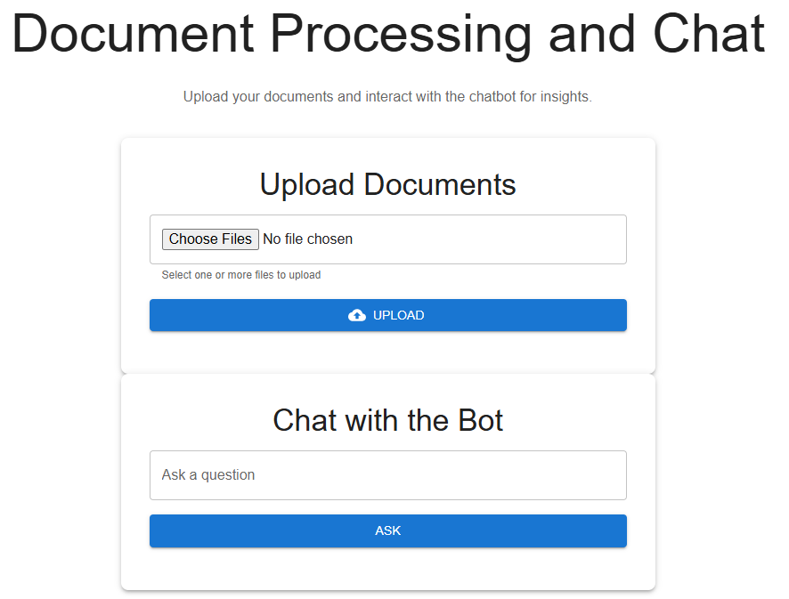

# RAG Chatbot



This project is a document processing chatbot that uses FastAPI for the backend and React for the frontend. The chatbot employs a Retrieval-Augmented Generation (RAG) approach, allowing users to upload documents, process them, and ask questions about the document content using a LangChain-powered Q&A system.

---

## Features

- **Document Upload**: Upload text and PDF files.
- **Document Processing**: Process uploaded files and store data in a vector store.
- **Interactive Chatbot**: Ask questions about the processed documents.
- **Frontend**: React-based user interface.
- **Backend**: FastAPI-based backend for file processing and Q&A.

---

## Technologies Used

- **Frontend**: React.js
- **Backend**: FastAPI, Python
- **Document Parsing**: LangChain, PyPDF
- **Database**: FAISS for vector storage
- **Styling**: CSS
- **API Testing**: Postman or equivalent tools

---

## Installation and Setup

### Prerequisites

- Docker and Docker Compose
- An `.env` file in the root directory containing your OpenAI API key:
   ```plaintext
   OPENAI_API_KEY=your_openai_api_key
   ```
- Node.js and npm (optional -for testing frontend)
- Python 3.8 or higher (optional -for testing backend)

### Running with Docker Compose

1. Clone the repository and navigate to the backend folder:
   ```bash
   git clone https://github.com/dheerajreddy2020/langchain-RAG-chatbot
   cd langchain-RAG-chatbot
   ```

2. Build the application using Docker Compose:
   ```bash
   docker compose build
   ```

2. Run the application:
   ```bash
   docker compose up -d
   ```

### Usage

1. Once Docker Compose starts the services, Open the browser and navigate to http://localhost:3000.
2. Upload documents and interact with the chatbot.

---


## Development (Optional)

If you want to contribute to the project or make modifications, you can set up the development environment:


### Backend Setup

1. Clone the repository and navigate to the backend folder:
   ```bash
   git clone https://github.com/dheerajreddy2020/langchain-RAG-chatbot
   cd backend
   ```

2. Create a virtual environment and activate it:
   ```bash
   python -m venv venv
   source venv/bin/activate  # On Windows: venv\Scripts\activate
   ```

3. Install dependencies
   ```bash
   pip install -r requirements.txt
   ```

4. Create a .env file in the backend folder and add your OpenAI API key:
   ```plaintext
   OPENAI_API_KEY=your_openai_api_key
   ```

5. Run the backend server
   ```bash
   uvicorn main:app --reload
   ```

### Frontend Setup

1. Navigate to the frontend folder:
   ```bash
   cd frontend
   ```
   
2. Install dependencies:
   ```bash
   npm install
   ```

3. Start the frontend development server:
   ```bash
   npm start
   ```

### Usage

1. Start the backend server using FastAPI.
2. Start the frontend server using React.
3. Open the browser and navigate to http://localhost:3000.
4. Upload documents and interact with the chatbot.

